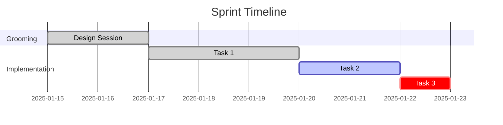

# CLAUDE.md

This file provides guidance to Claude Code (claude.ai/code) when working with code in this repository.

---

## What is ASAF?

**ASAF (Agile Scrum Agentic Flow)** is a markdown-based workflow system for Claude Code that structures software development into organized phases with AI agent collaboration.

**Key principle**: ASAF is conventions + prompts + file structure, NOT code. It's a set of slash commands (markdown files) that guide conversations and generate documentation.

---

## Architecture Overview

### Core Concept
- **Commands** = Markdown instruction files in `.claude/commands/`
- **Agents** = Personas (prompts) defined in `.claude/commands/shared/`
- **State** = Markdown files + `.state.json` for machine-readable tracking
- **No backend, no database** - Just file-based conventions

### Agent Personas
Each agent is Claude adopting a different persona via markdown instructions:

1. **Grooming Agent** (`grooming-agent.md`) - Senior engineering mentor conducting design sessions
2. **Executor Agent** (`executor-agent.md`) - Expert developer implementing code with specific tech stack profiles
3. **Reviewer Agent** (`reviewer-agent.md`) - Code reviewer with multiple modes (Harsh Critic, Supportive Mentor, Educational, Quick Review)
4. **Task Planner Agent** - Breaks features into executable tasks

### Workflow Phases
```
Init → Groom → Plan → Implement → Demo → Retro
```

Each phase:
- Validates state via `.state.json`
- Reads context from previous phases
- Generates documentation
- Updates state for next phase

---

## Repository Structure

**This repository** contains the ASAF command system:

```
asaf/
├── .claude/
│   └── commands/
│       ├── asaf-init.md
│       ├── asaf-groom.md
│       ├── asaf-groom-approve.md
│       ├── asaf-impl.md
│       ├── asaf-impl-pause.md
│       ├── asaf-impl-resume.md
│       ├── asaf-impl-review.md
│       ├── asaf-impl-approve.md
│       ├── asaf-express.md
│       ├── asaf-demo.md
│       ├── asaf-retro.md
│       ├── asaf-status.md
│       ├── asaf-select.md
│       ├── asaf-list.md
│       ├── asaf-help.md
│       ├── asaf-summary.md
│       └── shared/
│           ├── asaf-core.md         # Core principles
│           ├── grooming-agent.md    # Design conversation persona
│           ├── executor-agent.md    # Implementation persona
│           └── reviewer-agent.md    # Code review persona
├── README.md
├── CONTRIBUTING.md
├── LICENSE
├── install.sh        # Global installation script
├── uninstall.sh      # Uninstallation script
└── .gitignore
```

### User Project Structure (After Using ASAF)

When users run ASAF commands in their projects, this structure is created:

```
user-project/
├── asaf/                    # Created by /asaf-init
│   ├── .current-sprint.json # Sprint selection state (auto-created)
│   ├── <sprint-name>/       # Full ASAF sprint
│   │   ├── SUMMARY.md       # Single source of truth (human-readable)
│   │   ├── .state.json      # Machine-readable state
│   │   ├── initial.md       # Feature description
│   │   ├── grooming/        # Design phase outputs
│   │   │   ├── design.md
│   │   │   ├── edge-cases.md   # Min 10 edge cases
│   │   │   ├── acceptance-criteria.md  # Min 5 criteria
│   │   │   ├── decisions.md     # Technical choices + executor/reviewer config
│   │   │   └── conversation-log.md
│   │   ├── implementation/  # Execution phase
│   │   │   ├── tasks.md
│   │   │   └── progress.md  # Real-time implementation log
│   │   ├── demo/
│   │   └── retro/
│   └── express/             # Quick tasks (lightweight)
│       └── <task-name>/
├── personal-goals.md        # Optional: developer learning goals
└── src/                     # User's actual code
```

---

## State Management

### .state.json Format
```json
{
  "sprint": "sprint-name",
  "type": "full" | "express",
  "phase": "grooming" | "planning" | "implementation" | "demo" | "retro",
  "status": "ready" | "in-progress" | "complete" | "blocked",
  "current_task": 3,
  "total_tasks": 5,
  "grooming_approved": true,
  "implementation_complete": false
}
```

**Critical**: All commands MUST validate state before execution. Check phase and prerequisites.

---

## Sprint Selection State

### .current-sprint.json Format

Located at `/asaf/.current-sprint.json`, this file tracks which sprint is currently active:

```json
{
  "sprint": "sprint-name",
  "selected_at": "2025-10-31T12:00:00Z",
  "type": "full"
}
```

### Auto-Selection Algorithm

When `.current-sprint.json` is missing, commands automatically:
1. Scan `/asaf/` for valid full sprints (have `.state.json`)
2. Sort by `.state.json` modification time (most recent first)
3. Use alphabetical order as tiebreaker
4. Create `.current-sprint.json` with selected sprint
5. Log: "Auto-selected sprint '<name>' (most recently modified)"
6. Continue execution

### Sprint Selection Validation Pattern (Step 0)

All sprint-context commands include this as Step 0:

```markdown
## Step 0: Verify Active Sprint

1. Check if /asaf/.current-sprint.json exists
   - If NO: Run auto-selection algorithm (see asaf-core.md)
   - If YES: Read sprint name from file

2. Validate selected sprint exists at /asaf/<sprint-name>/
   - If NO: Delete stale file, run auto-selection
   - If YES: Continue

3. Validate sprint has .state.json
   - LENIENT: Warn but continue if missing

4. Set context: All operations use /asaf/<sprint-name>/
```

### Commands Requiring Sprint Context

All commands EXCEPT:
- `/asaf-list` (lists all sprints)
- `/asaf-help` (shows help)
- `/asaf-select` (sets selection)
- `/asaf-init` (creates new sprint, prompts to set as current)

### Git Behavior

`.current-sprint.json` can be:
- **Committed**: Share active sprint across team/machines
- **Ignored**: Add to `.gitignore` for local-only selection (recommended for solo work)

---

## Implementation Loop Pattern

The `/asaf-impl` command runs autonomously with this pattern:

```
For each task:
  iteration = 1
  while iteration <= max_iterations:

    1. EXECUTOR PHASE
       - Adopt executor-agent.md persona
       - Read task + design + edge cases
       - Implement code
       - Write tests
       - Run tests
       - Document in progress.md

    2. REVIEWER PHASE
       - Adopt reviewer-agent.md persona
       - Review code against design
       - Verify edge case coverage
       - Check test coverage
       - APPROVE or REQUEST CHANGES

    3. DECISION
       if APPROVED:
         Mark task complete, move to next
       else if iteration < max:
         iteration++, executor addresses feedback
       else:
         Mark BLOCKED, pause, require human intervention
```

**Auto-pause conditions**: Max iterations reached, test framework crashes, file write errors, infinite loop detected.

---

## Key Commands

### Core Workflow
- `/asaf-init <name>` - Initialize sprint, create folder structure
- `/asaf-select [name]` - Select active sprint (interactive if no name)
- `/asaf-groom` - Modular design conversation (Quick/Standard/Deep modes)
- `/asaf-groom-approve` - Lock grooming, generate tasks.md
- `/asaf-impl` - Autonomous implementation (3-6 hours)
- `/asaf-impl-pause` / `/asaf-impl-resume` - Control execution
- `/asaf-impl-feedback` - Structured post-implementation changes with quality gates
- `/asaf-status` - Current sprint state (shows selected sprint prominently)
- `/asaf-demo` - Generate demo presentation
- `/asaf-retro` - Learning retrospective

### Express Mode
- `/asaf-express "<description>"` - Quick task workflow
- `/asaf-express --auto` - Fully autonomous for trivial tasks

---

## Executor Profiles

Defined in `executor-agent.md`, profiles determine language/framework expertise:

- `typescript-fullstack-executor` - TypeScript, React, Node.js, Express, Prisma
- `typescript-backend-executor` - TypeScript, Node.js, Express, REST APIs
- `typescript-frontend-executor` - TypeScript, React, Next.js
- `python-backend-executor` - Python, FastAPI/Django/Flask, SQLAlchemy, pytest
- `python-data-executor` - Python, pandas, numpy, Jupyter
- `rust-systems-executor` - Rust, systems programming
- `go-microservices-executor` - Go, gRPC, Docker

Auto-detected from codebase (package.json, requirements.txt, etc.) during grooming.

---

## Reviewer Modes

Defined in `reviewer-agent.md`, modes control feedback style:

- **Harsh Critic** - Direct, high standards, minimal praise
- **Supportive Mentor** - Encouraging, constructive, explains rationale
- **Educational** - Deep explanations of "why", learning-focused
- **Quick Review** - Fast, checklist-based

Selected based on `personal-goals.md` (developer experience + learning goals).

---

## Personal Goals Integration

Optional `personal-goals.md` (project root or `~/.claude/`) defines:
- Experience level per domain (backend, frontend, etc.)
- Current learning goals
- Reviewer preferences

Used to:
- Configure reviewer mode
- Align tasks with learning objectives
- Track skill progression in retrospectives

---

## Modular Grooming System

### Why Modular Grooming?

**Problem**: Original ASAF grooming took 30-45 minutes for ALL features, causing users to skip ASAF for simple tasks.

**Solution**: Three grooming modes that match depth to complexity.

### Grooming Modes

| Mode | Duration | Use Case | Story Points | Min Edge Cases | Min AC |
|------|----------|----------|--------------|----------------|--------|
| **🟢 Quick** | 5-10 min | Simple, clear requirements | 1-2 | 3-5 | 2-3 |
| **🟡 Standard** | 20-30 min | Medium complexity | 4-8 | 8-10 | 5 |
| **🔴 Deep** | 40-60 min | Complex, many unknowns | 8+ | 15+ | 8+ |

### Mode Selection

At the start of `/asaf-groom`, user chooses mode based on feature complexity:

```
How complex is this feature?

1. Simple (1-2 points) → Quick Grooming (5-10 min)
2. Medium (4-8 points) → Standard Grooming (20-30 min)
3. Complex (8+ points) → Deep Grooming (40-60 min)
```

### Mode-Adaptive Behavior

**Quick Mode** (Streamlined):
- 2-3 key questions in Phase 1 (Understanding)
- High-level approach only in Phase 2 (Technical Design)
- TOP 3-5 critical risks only in Phase 3 (Edge Cases)
- 2-3 main criteria in Phase 4 (Acceptance Criteria)
- Standard settings in Phase 5 (Execution Planning)

**Standard Mode** (Thorough):
- Full 5-question exploration
- Collaborative design with trade-offs
- Comprehensive edge cases (10 across categories)
- 5 detailed acceptance criteria
- Profile and reviewer selection

**Deep Mode** (Comprehensive):
- 8+ questions with user research
- Multiple architecture options
- Extensive edge cases (15+) with priority ranking
- 8+ criteria with test scenarios
- Custom executor config, risk mitigation

### Benefits

1. **Faster for simple tasks**: Quick mode (5-10 min) vs old (30-45 min)
2. **Appropriate rigor**: Match depth to complexity
3. **No skipping**: Users use ASAF even for small tasks
4. **Quality maintained**: Minimum requirements enforced per mode

### Impact

- **Expected**: 3x increase in ASAF usage for small-medium tasks
- **User satisfaction**: "Grooming no longer too long"

---

## Focused Edge Case Discovery

### Why Focused Edge Cases?

**Problem**: Grooming asked about ALL edge case categories (input, auth, database, API, etc.) even when not relevant, wasting time.

**Solution**: Feature classification + category filtering.

### How It Works

**Step 1: Feature Classification** (30 seconds)

Before discussing edge cases, Claude analyzes the feature:

```
Analyzing feature characteristics from design.md...

Feature type detected:
✅ UI Component: Yes
✅ Backend API: No
✅ Database interaction: No
✅ External services: No

Relevant edge case categories for THIS feature:
🎯 HIGH Priority (must cover):
- UI/UX edge cases
- State management

🔸 MEDIUM Priority (should cover):
- Browser compatibility

❌ Not Relevant (skip):
- Database errors
- API failures
- Authentication
```

**Step 2: Targeted Questions**

Only ask about HIGH and MEDIUM priority categories:

- ✅ "What if user toggles dark mode while modal is open?" (UI/UX)
- ✅ "What if localStorage is disabled?" (State)
- ❌ Skip: "What if database is down?" (Not relevant for UI-only feature)

### Feature Classification Matrix

| Feature Type | Focus Categories | Skip Categories |
|--------------|------------------|-----------------|
| **UI Component** | UI/UX, State, Browser | Database, Auth, API |
| **Backend API** | Input, Auth, Database, Errors | UI/UX, Browser |
| **Background Job** | Concurrency, Recovery, Retries | UI/UX, Input |
| **Database Migration** | Data Integrity, Rollback | UI/UX, Input |
| **Authentication** | Security, Session, Tokens | (Most relevant) |

### Benefits

1. **Relevant edge cases**: 80%+ relevance (vs 40% before)
2. **Less wasted time**: Skip irrelevant categories
3. **Better focus**: Deep dive on what matters
4. **Quality maintained**: Still comprehensive for relevant categories

### Example

**Before** (Generic approach):
- 10 edge cases, 4 relevant, 6 irrelevant → 40% relevance

**After** (Focused approach):
- 5 edge cases, 5 relevant, 0 irrelevant → 100% relevance

---

## Post-Implementation Feedback Loop

### Why /asaf-impl-feedback?

**Problem**: After `/asaf-impl`, users provide feedback in ad-hoc conversations:
- Changes made without reviewer oversight
- No edge case validation
- Tests not updated
- Quality degrades

**Solution**: Structured feedback with same quality gates as implementation.

### How It Works

**Step 1: Collect Feedback** (3 modes)

1. **Interactive Review**: Claude walks through each task
2. **Bulk Feedback**: User provides all feedback upfront
3. **Specific Changes**: User has exact changes to make

**Step 2: Categorize**

```
Feedback Summary:

🔴 BUGS (must fix):
- Task 2: Login fails with special characters

🟡 IMPROVEMENTS (should fix):
- Task 1: Error messages too technical
- Task 3: Missing logging

🟢 ENHANCEMENTS (nice to have):
- Task 4: Add "remember me" checkbox

Which items should I address?
1. All
2. Bugs + improvements only
3. Bugs only
4. Custom selection
```

**Step 3: Execute with Quality Gates**

For each feedback item:

1. **Executor Phase**: Implement change
2. **Test Phase**: Run tests, add new tests if needed
3. **Reviewer Phase**: Check against grooming docs
   - ✅ Aligns with design.md?
   - ✅ Edge case coverage maintained?
   - ✅ Test coverage sufficient?
   - ✅ Code quality met?
4. **Documentation Phase**: Update progress.md

**Step 4: Update Documentation**

All feedback tracked in `implementation/progress.md`:

```markdown
### Feedback Iteration - Round 1

#### Feedback Item 1: Fix special character bug
**Category**: Bug
**Status**: ✅ Complete

**Changes**:
- src/auth/validation.ts (updated regex)

**Tests**:
- Added: test_password_with_special_chars()

**Reviewer Notes**:
✅ Aligns with edge case #4
✅ Test coverage: 100%
```

### Multiple Feedback Rounds

Can run `/asaf-impl-feedback` multiple times:

```
Round 1: Fix 3 bugs, 2 improvements
Round 2: Add 1 enhancement, refactor 1 module
Round 3: Polish error messages
```

All tracked in progress.md and SUMMARY.md.

### Benefits

1. **Quality maintained**: Same rigor as /asaf-impl
2. **All feedback documented**: Easy to track what changed
3. **Tests updated**: Coverage doesn't degrade
4. **Reviewer oversight**: No ad-hoc changes bypassing quality gates
5. **Categorization**: Prioritize bugs over enhancements

### Impact

- **Expected**: 90%+ of feedback changes pass quality gates
- **Quality retention**: Post-impl changes maintain implementation quality

---

## Story Points System

### Why Story Points Instead of Time Estimates

ASAF uses **story points** for task complexity estimation instead of time-based estimates. This approach is more appropriate because:

1. **Time-agnostic** - Claude works at a different pace than humans; time estimates are meaningless
2. **Universal complexity measure** - Story points represent intrinsic complexity regardless of who executes
3. **Industry standard** - Developers are already familiar with agile story points
4. **Better for planning** - Forces clear distinction between simple vs complex tasks
5. **Retrospective insights** - Enables velocity tracking and estimation accuracy analysis

### Story Point Scale (1/2/4/8)

ASAF uses a simplified Fibonacci-like scale:

| Points | Complexity | Description | Max Iterations | Examples |
|--------|------------|-------------|----------------|----------|
| **1** | Trivial | Simple config change, single file edit, well-defined | 2 | Update constant, add field to schema, simple UI text change |
| **2** | Simple | Straightforward implementation, clear requirements, minimal unknowns | 3 | Add validation rule, create simple endpoint, basic component |
| **4** | Complex | Multiple components, design decisions, integration points, many edge cases | 4 | Authentication system, multi-step workflow, complex business logic |
| **8** | Very Complex | Architecture changes, high uncertainty, cross-cutting concerns | 5 | Major refactoring, new architecture layer, third-party integration |

**Note**: If a task is estimated at 8 points, consider breaking it down into smaller 2-4 point tasks.

### Task Planning with Story Points

During `/asaf-groom-approve`, the Task Planner Agent:

1. **Analyzes requirements** from grooming documents
2. **Breaks down feature** into 3-8 executable tasks
3. **Assigns story points** to each task with rationale
4. **Maps complexity to max iterations**:
   - 1 point → 2 max iterations
   - 2 points → 3 max iterations
   - 4 points → 4 max iterations
   - 8 points → 5 max iterations (or suggest breakdown)

### tasks.md Format with Story Points

```markdown
## Task 1: Implement User Authentication

**Complexity**: 4 story points

**Complexity Rationale**:
Multiple components required (middleware, session storage, password hashing),
security considerations, integration with existing user model, multiple edge
cases for invalid credentials and session management.

**Max Iterations**: 4 (based on 4-point complexity)

**Description**:
[Task description...]

**Definition of Done**:
- [ ] Middleware authenticates requests
- [ ] Sessions stored securely
- [ ] Edge cases #1-5 handled
- [ ] All tests passing
```

### Sprint Velocity Tracking

During `/asaf-retro`, velocity metrics are calculated:

**Velocity Formula**:
```
Velocity = (Completed Story Points / Planned Story Points) × 100%
```

**Example**:
- Planned: 18 points (8 tasks)
- Completed: 16 points (7 tasks, 1 blocked)
- **Velocity: 88.9%** ← Good velocity

### Velocity Interpretation

| Velocity | Interpretation | Typical Actions |
|----------|---------------|-----------------|
| **< 70%** | Low - significant blockers or underestimation | Review grooming quality, break down complex tasks, check for unclear requirements |
| **70-90%** | Good - normal range with minor issues | Minor adjustments, continue current approach |
| **> 90%** | Excellent - accurate estimation or overestimation | Consider taking on slightly more complexity, verify estimates weren't inflated |

### Retrospective Metrics

The `/asaf-retro` command generates comprehensive velocity analysis:

**Included in retro/learnings.md**:
- Total story points (planned vs completed)
- Velocity percentage
- Complexity breakdown by point value
- Iteration efficiency (avg iterations per task)
- Tasks completed in 1 iteration (ideal execution)
- Tasks needing 3+ iterations (complexity indicators)
- Velocity trend (if multiple sprints tracked)
- Estimating accuracy lessons

**Example Velocity Analysis**:
```markdown
## Sprint Velocity Metrics

**Story Points**:
- Planned: 20 points
- Completed: 18 points
- **Velocity**: 90%

**Complexity Breakdown**:
| Complexity | Planned | Completed | Completion Rate |
|------------|---------|-----------|-----------------|
| 1 point    | 2       | 2         | 100%            |
| 2 points   | 4       | 4         | 100%            |
| 4 points   | 3       | 2         | 67%             |
| 8 points   | 1       | 1         | 100%            |

**Iteration Efficiency**:
- Average iterations per task: 2.1
- Tasks completed in 1 iteration: 5 (50%)
- Tasks needing 3+ iterations: 2 (20%)

**Velocity Analysis**:
- **Excellent velocity**: 90% completion
- **Success factors**: Thorough grooming, accurate estimation for simple tasks
- **Note**: One 4-point task blocked due to external API instability (not estimation issue)
```

### Benefits of Story Points in ASAF

1. **Consistent Planning** - Task complexity is objective across sprints
2. **Velocity Trends** - Track improvement in estimation accuracy over time
3. **Capacity Planning** - Know how many story points can be completed per sprint
4. **Retrospective Insights** - Analyze which complexity levels are estimated accurately
5. **Iteration Mapping** - Automatic max iteration assignment based on complexity
6. **Risk Identification** - 8-point tasks flag need for breakdown
7. **Learning Tool** - See which estimates were accurate vs inaccurate and why

### Story Points vs Time Estimates Comparison

| Aspect | Story Points (ASAF) | Time Estimates (Traditional) |
|--------|---------------------|------------------------------|
| **Measurement** | Relative complexity | Hours/days |
| **Executor Speed** | Independent | Dependent |
| **Accuracy** | Consistent across sprints | Varies by context |
| **Planning** | Points per sprint (velocity) | Hours available |
| **Retrospective** | Velocity % | Schedule adherence |
| **Usefulness for AI** | ✅ Highly relevant | ❌ Not meaningful |

---

## Demo Generation Architecture

### Overview

The `/asaf-demo` and `/asaf-demo-regenerate` commands implement a **hybrid template-based presentation generator** that creates audience-specific demo presentations from ASAF sprint documentation.

**Key principle**: Combine markdown command logic with separate reusable templates to maintain ASAF's file-based philosophy while enabling maintainable customization.

### Architecture Components

```
.claude/commands/
├── asaf-demo.md              # Interactive prompt-based generation
├── asaf-demo-regenerate.md   # CLI-based regeneration
└── templates/
    └── demo/
        ├── technical-team.md      # High technical depth
        ├── product-team.md        # Balanced business + technical
        ├── executive.md           # Business value focus
        ├── customer.md            # Benefits-only, zero technical
        └── slides/
            ├── common/            # Shared across all audiences
            │   ├── title.md
            │   ├── agenda.md
            │   └── qa.md
            └── content/           # Audience-specific content
                ├── architecture.md
                ├── code-example.md
                ├── business-value.md
                ├── timeline.md
                ├── metrics.md
                ├── edge-cases.md
                ├── testing.md
                └── next-steps.md
```

### Template System

#### Audience Templates

Each template (`templates/demo/{audience}.md`) contains:

1. **Metadata Section** (YAML frontmatter):
```yaml
---
audience: technical-team
technical_depth: high | medium | minimal | none
business_focus: low | medium | high
code_examples: yes | no | never
diagrams: required | optional | timeline-only | simple-visuals-only
---
```

2. **Slide Selection Map**:
Defines which slides to include based on presentation length:
- **Quick (5 min)**: 4-6 slides (Title, Context, Demo, Q&A)
- **Standard (15 min)**: 10-15 slides (full flow without deep dives)
- **Extended (30 min)**: 20-25 slides (includes deep dives, examples)
- **Workshop (45 min)**: 30-35 slides (comprehensive with exercises)

3. **Content Extraction Mappings** (11 detailed mappings):
Maps ASAF source documents to slide content:
```markdown
### Mapping 1: Feature Overview
**Source**: initial.md (entire file)
**Target Slide**: "What We Built"
**Extraction**: Take full feature description, reformat as bullet points

### Mapping 2: Architecture
**Source**: grooming/design.md → Architecture section
**Target Slide**: "Technical Architecture" (+ diagram if enabled)
**Extraction**: Component list, relationships, data flow

### Mapping 3: Edge Cases
**Source**: grooming/edge-cases.md (all scenarios)
**Target Slide**: "Edge Cases Handled"
**Extraction**: Group by category (Input, Auth, System, Security, Performance)
[... 8 more mappings ...]
```

4. **Tone/Language Rules**:
Defines terminology translations for each audience:
```markdown
# Technical Team
- Use precise technical terms: "async/await", "REST API", "JWT"
- Show code examples with syntax highlighting
- Include architecture diagrams (Mermaid)

# Executive
- "Fast response time" → "Improved productivity"
- "Scalable architecture" → "Growth-ready solution"
- NEVER show code, NEVER use jargon
- Include ROI framework and 3-year financial model
```

5. **Slide Sequence**:
Ordered list of slides with conditional inclusion:
```markdown
## Slide Sequence (15-minute baseline)

1. **Title Slide** (common/title.md)
2. **Technical Context** - Why this feature? (initial.md)
3. **Architecture** + diagram (design.md) [if diagrams enabled]
4. **Implementation** + code (progress.md) [technical only]
5. **Edge Cases** (edge-cases.md)
6. **Testing Strategy** (tasks.md) [technical/product only]
7. **Live Demo** (acceptance-criteria.md)
8. **Performance** (progress.md metrics) [if enhancement enabled]
9. **Business Value** (design.md) [product/executive/customer]
10. **Timeline** (state.json + progress.md) [if enhancement enabled]
11. **Risks & Mitigations** (edge-cases.md) [if enhancement enabled]
12. **Next Steps** (retro/) [if enhancement enabled]
13. **Q&A** (common/qa.md)
```

#### Common Slide Templates

**Purpose**: Reusable slide building blocks shared across all audiences.

Located in `templates/demo/slides/common/`:
- `title.md` - Sprint name, tagline, date
- `agenda.md` - Dynamic table of contents
- `qa.md` - Closing slide with contact info

**Variable placeholders**: `{sprint}`, `{tagline}`, `{date}`, `{items}`

#### Content Slide Templates

**Purpose**: Audience-specific slide layouts for common content types.

Located in `templates/demo/slides/content/`:
- `architecture.md` - System architecture with Mermaid diagram slot
- `code-example.md` - Syntax-highlighted code block with explanation
- `business-value.md` - ROI framework, metrics, value proposition
- `timeline.md` - Gantt chart showing sprint progression
- `metrics.md` - Performance/usage statistics with visualization
- `edge-cases.md` - Tabular edge case coverage
- `testing.md` - Test strategy and coverage stats
- `next-steps.md` - Roadmap and follow-up actions

### Interactive Prompt System (/asaf-demo)

The `/asaf-demo` command implements a **7-phase execution flow** with 5 interactive prompts:

#### Phase 1: Interactive Prompts

**Prompt 1: Presentation Length**
```
Choose [1-5]:
1. Quick (5 minutes)       → 4-6 slides
2. Standard (15 minutes)   → 10-15 slides
3. Extended (30 minutes)   → 20-25 slides
4. Workshop (45 minutes)   → 30-35 slides
5. Custom length (1-120)   → Formula-based

Validation: 1-120 minutes, default to 15 if invalid after 3 attempts
```

**Prompt 2: Target Audience**
```
Choose [1-4]:
1. Technical Team    → High depth, code examples, diagrams
2. Product Team      → Balanced business + technical
3. Executive         → Business value, ROI, zero jargon
4. Customer          → Benefits only, zero technical

Validation: Must select 1-4, determines template loading
```

**Prompt 3: Output Format**
```
Choose [1-3]:
1. Markdown Slides   → Marp/Slidev/reveal.js compatible
2. Outline          → Hierarchical bullet points
3. Presentation Script → Speaker notes format

Default: markdown-slides
```

**Prompt 4: Include Diagrams**
```
Include diagrams? [y/n]
- Architecture (Mermaid graph)
- User flows (Mermaid flowchart)
- Timeline (Gantt chart)

Default: yes (except for customer audience)
```

**Prompt 5: Enhancements**
```
Select enhancements (comma-separated or 'none'):
1. code       → Add code examples from progress.md
2. metrics    → Include performance/usage stats
3. timeline   → Show sprint progression (Gantt)
4. risks      → Risk analysis + mitigations
5. next-steps → Roadmap and follow-up actions

Validation: Check each enhancement has required source data
```

#### Phase 2: Template Loading & Slide Calculation

**Formula**:
```javascript
base_slides = presentation_length_minutes × 0.75

// Audience adjustments
if (audience === "technical-team") base_slides += 2;
if (audience === "executive") base_slides -= 2;

// Diagram adjustment
if (include_diagrams) base_slides += 1;

// Enhancement adjustments
enhancement_count = enhancements.length;
base_slides += enhancement_count;

// Round and clamp
final_slide_count = Math.round(base_slides);
final_slide_count = Math.max(4, Math.min(final_slide_count, 50));
```

**Example**: 30-minute executive presentation with timeline + risks, no diagrams
```
30 × 0.75 = 22.5 (base)
- 2 (executive adjustment)
+ 0 (no diagrams)
+ 2 (timeline + risks enhancements)
= 22.5 slides (rounded to 23)
```

#### Phase 3: Content Generation

**Source Document Loading** (8 files):
1. `initial.md` → Feature description
2. `grooming/design.md` → Architecture, components, flows
3. `grooming/edge-cases.md` → Edge case scenarios
4. `grooming/acceptance-criteria.md` → Success criteria
5. `grooming/decisions.md` → Technical choices
6. `implementation/tasks.md` → Task breakdown
7. `implementation/progress.md` → Implementation notes, code, metrics
8. `.state.json` → Timeline, task counts

**Content Extraction Logic**:
```markdown
For each slide in template sequence:
  1. Load source document(s) specified in mapping
  2. Extract relevant sections (markdown heading-based)
  3. Apply audience tone/language rules
  4. Format according to output format (slides/outline/script)
  5. Replace {placeholders} with extracted content
  6. Apply slide count density adjustment if needed
```

**Density Adjustment**: If extracted content produces slide count mismatch:
- **Over count**: Combine related slides, summarize verbose sections
- **Under count**: Split complex slides, add detail/examples

#### Phase 4: Diagram Generation

**Architecture Diagram** (Mermaid graph):
```markdown
```mermaid
graph TB
    Component1[{name}] --> Component2[{name}]
    Component2 --> Database[(Database)]
    Component3[External API] --> Component1
```
```
**Source**: design.md Architecture section
**Extraction**: Parse component list, infer relationships

**User Flow Diagram** (Mermaid flowchart):
```markdown
```mermaid
flowchart TD
    Start[User starts] --> Action1[{step}]
    Action1 --> Decision{Condition?}
    Decision -->|Yes| Success[✅ Complete]
    Decision -->|No| Action2[{alternate}]
    Action2 --> Success
```
```
**Source**: design.md User Flows section

**Timeline Diagram** (Gantt chart):
```markdown

```
**Source**: .state.json timestamps + tasks.md

#### Phase 5: Enhancement Processing

**Code Examples** (`code` enhancement):
- **Source**: progress.md code blocks
- **Processing**: Extract 2-3 key code snippets, add syntax highlighting
- **Placement**: After implementation slide

**Metrics** (`metrics` enhancement):
- **Source**: progress.md performance notes, test results
- **Processing**: Create table/chart of key metrics
- **Placement**: Dedicated performance slide

**Timeline** (`timeline` enhancement):
- **Source**: .state.json timestamps
- **Processing**: Generate Gantt chart (see diagram generation)
- **Placement**: After demo slide

**Risks** (`risks` enhancement):
- **Source**: edge-cases.md → identify risks, decisions.md → mitigations
- **Processing**: Create risk matrix (likelihood × impact)
- **Placement**: After implementation slides

**Next Steps** (`next-steps` enhancement):
- **Source**: retro/ folder if exists, else infer from progress.md notes
- **Processing**: Roadmap bullets, timelines, dependencies
- **Placement**: Before Q&A slide

#### Phase 6: Output Formatting

**Markdown Slides Format** (Marp/Slidev compatible):
```markdown
---
marp: true
theme: default
paginate: true
---

# Slide Title

Content here

---

# Next Slide

More content
```

**Outline Format**:
```markdown
# Presentation Outline: {sprint}

## 1. Introduction (2 minutes)
   - Feature overview
   - Why we built this

## 2. Technical Architecture (5 minutes)
   - System components
   - Data flow
   [... hierarchical structure ...]
```

**Presentation Script Format**:
```markdown
# Presentation Script: {sprint}

## Slide 1: Title
**Display**: {sprint} - {tagline}
**Speaker Notes**: Good morning everyone. Today I'll be presenting...

## Slide 2: Context
**Display**: {feature description}
**Speaker Notes**: This feature addresses...
```

#### Phase 7: File Generation & State Update

**Output Files**:

1. `DEMO-PRESENTATION.md` - The generated presentation
2. `DEMO-CONFIG.json` - Configuration for regeneration:
```json
{
  "sprint": "sprint-name",
  "generated_at": "2025-10-31T14:30:00Z",
  "presentation_length_minutes": 30,
  "audience_type": "executive",
  "output_format": "markdown-slides",
  "include_diagrams": false,
  "enhancements": ["timeline", "risks"],
  "slide_count": 23,
  "template_version": "1.0",
  "source_files": [
    "initial.md",
    "grooming/design.md",
    "grooming/edge-cases.md",
    "grooming/acceptance-criteria.md",
    "grooming/decisions.md",
    "implementation/tasks.md",
    "implementation/progress.md",
    ".state.json"
  ]
}
```

**State Update**:
```json
{
  "phase": "demo",
  "demo_generated": true,
  "demo_generated_at": "2025-10-31T14:30:00Z"
}
```

### Regeneration System (/asaf-demo-regenerate)

**Purpose**: Modify presentation parameters without re-answering all prompts.

**CLI Arguments**:
```bash
/asaf-demo-regenerate [OPTIONS]

OPTIONS:
  --audience <type>         # technical, product, executive, customer
  --length <minutes>        # 5, 15, 30, 45, or 1-120
  --format <format>         # markdown-slides, outline, script
  --diagrams <yes|no>       # yes, no, y, n
  --enhancements <list>     # code, metrics, timeline, risks, next-steps
                            # (comma-separated, or "none")
```

**Precedence System**:
```javascript
// Load existing config
config = read_json("DEMO-CONFIG.json");

// Merge with CLI args (CLI overrides)
merged = {
  presentation_length_minutes: CLI.length ?? config.presentation_length_minutes,
  audience_type: CLI.audience ?? config.audience_type,
  output_format: CLI.format ?? config.output_format,
  include_diagrams: CLI.diagrams ?? config.include_diagrams,
  enhancements: CLI.enhancements ?? config.enhancements
};

// Regenerate presentation with merged config
```

**Regeneration Tracking**:
```json
{
  "regenerated_at": "2025-10-31T15:00:00Z",
  "regeneration_count": 2,
  "regeneration_history": [
    {
      "regenerated_at": "2025-10-31T14:45:00Z",
      "changes": ["audience: technical → executive"]
    },
    {
      "regenerated_at": "2025-10-31T15:00:00Z",
      "changes": ["length: 15 → 30", "enhancements: added 'timeline'"]
    }
  ]
}
```

**Edge Cases**:
- **Missing config**: Prompt to run `/asaf-demo` first
- **Invalid CLI args**: Validate, show error, preserve original config
- **Partial regeneration**: Update only changed sections (future enhancement)

### Edge Case Handling

**Comprehensive coverage** (15 edge cases documented in design.md):

1. **Out of range input**: Clamp to 1-120 minutes
2. **No grooming data**: Generate simplified demo from initial.md only
3. **Express sprint**: Auto-adjust to 5-minute quick format
4. **User cancels**: Clean exit, no files written
5. **Slide count mismatch**: Auto-adjust density (combine/split slides)
6. **Implementation incomplete**: Add WIP badge to slides
7. **Missing enhancement data**: Use placeholders, warn user
8. **No diagrams available**: Skip diagram generation
9. **Multiple audiences**: Not supported, require single selection
10. **Invalid inputs (3x)**: Default to standard/technical/markdown-slides
11. **Cancel at preview**: Offer "remove enhancements" option
12. **Very short presentation (<5 min)**: Minimum 4 slides enforced
13. **Very long presentation (>60 min)**: Warn about attention span
14. **Missing template file**: Fallback to technical-team.md
15. **Config file corrupted**: Regenerate from scratch with prompts

### Extension Guide: Custom Templates

**To add a new audience template**:

1. **Create template file**: `.claude/commands/templates/demo/{audience-name}.md`

2. **Define metadata**:
```yaml
---
audience: custom-audience-name
technical_depth: high | medium | minimal | none
business_focus: low | medium | high
code_examples: yes | no | never
diagrams: required | optional | timeline-only | simple-visuals-only
---
```

3. **Define slide selection map**:
```markdown
## Slide Selection Map

### Quick (5 minutes) - 5 slides
1. Title (common/title.md)
2. Custom intro slide
3. Demo
4. Value proposition
5. Q&A (common/qa.md)

### Standard (15 minutes) - 12 slides
[... define sequence ...]
```

4. **Define 11 content extraction mappings**:
```markdown
### Mapping 1: Feature Overview
**Source**: initial.md
**Target Slide**: "Custom Feature Intro"
**Extraction**: [describe extraction logic]
[... 10 more mappings ...]
```

5. **Define tone/language rules**:
```markdown
## Language Rules

### Terminology Translations
- "Technical term" → "Audience-appropriate term"

### Formatting Guidelines
- Use {formatting style}
- Avoid {red flags}
```

6. **Update `/asaf-demo` prompt**:
```markdown
### Prompt 2: Target Audience
Choose [1-5]:
1. Technical Team
2. Product Team
3. Executive
4. Customer
5. Custom Audience  ← ADD THIS
```

7. **Update installation**: Modify `install.sh` to copy new template

8. **Test workflow**:
```bash
/asaf-demo
# Select custom audience
# Verify slide count, content, tone
```

**To add a new enhancement**:

1. **Update enhancement prompt** in `asaf-demo.md`:
```markdown
6. custom-enhancement → Description
```

2. **Define source data requirements**:
```markdown
### Enhancement: Custom Enhancement
**Required Source**: grooming/decisions.md (specific section)
**Processing Logic**: [describe extraction/transformation]
**Output**: [describe slide format]
**Placement**: After [slide name]
```

3. **Update slide calculation formula**:
```javascript
if (enhancements.includes('custom-enhancement')) {
  base_slides += 2; // Custom enhancement adds 2 slides
}
```

4. **Implement validation**:
```javascript
if (enhancements.includes('custom-enhancement')) {
  if (!file_exists('grooming/decisions.md')) {
    warn("Custom enhancement requires decisions.md");
    remove_from_enhancements('custom-enhancement');
  }
}
```

### Best Practices

**When using demo commands**:
- Run `/asaf-demo` after implementation complete for accurate metrics
- Choose audience based on actual presentation context
- Use regeneration for quick parameter tweaks
- Preview slides before converting to presentation format
- Customize templates for organization-specific branding

**When modifying templates**:
- Maintain consistent metadata structure across all templates
- Test with sprints of varying complexity (simple vs. complex features)
- Validate all 11 content mappings with real sprint data
- Document tone/language rules clearly
- Follow ASAF philosophy: human-readable markdown, no code dependencies

**When debugging presentations**:
- Check `DEMO-CONFIG.json` for actual parameters used
- Verify source files exist and contain expected sections
- Test each enhancement independently
- Use outline format for quick content verification
- Check slide count formula if count seems wrong

---

## Error Handling Conventions

All commands follow this pattern:

### Severity Levels
- 🔴 CRITICAL - Cannot continue, requires intervention
- 🟡 WARNING - Can continue with degradation
- 🔵 INFO - Informational only

### Error Response Format
```
🔴 ERROR: [Short description]

[Detailed explanation]

Possible reasons:
  - [Reason 1]
  - [Reason 2]

Troubleshooting:
  1. [Step 1]
  2. [Step 2]

[Recovery options or next steps]
```

### Recovery Patterns
1. **Auto-retry** - Transient failures (3 attempts)
2. **Checkpoint & Resume** - Save state before failure
3. **Graceful Degradation** - Continue with reduced functionality
4. **Escalation** - Present options to user

---

## Document Generation Standards

### Grooming Phase Outputs
All documents generated during `/asaf-groom`:
- **design.md** - Architecture, components, data models, user flows, security
- **edge-cases.md** - Minimum 10 scenarios (Input, Auth, System Errors, Security, Performance)
- **acceptance-criteria.md** - Minimum 5 testable criteria
- **decisions.md** - Technical choices with alternatives + rationale, executor/reviewer config
- **conversation-log.md** - Full Q&A transcript

### Implementation Phase Outputs
- **tasks.md** - Sequential tasks with complexity, max iterations, execution pattern
- **progress.md** - Real-time log with executor notes, test results, reviewer feedback

### SUMMARY.md
Always keep updated as single source of truth. Include:
- Current phase and status
- Feature description
- Key decisions
- Progress checklist
- Implementation results (when complete)

---

## Conversation Style Requirements

### Grooming Agent Conversation
- **ONE question at a time** (never overwhelm)
- Acknowledge answers before next question
- Probe ambiguity: "When you say X, do you mean Y or Z?"
- Present options with trade-offs, not single solutions
- Search codebase for existing patterns
- Search web for best practices when needed
- Connect work to personal goals
- Explain reasoning: "I'm asking this because..."

### Executor Agent Behavior
- Follow design from design.md strictly
- Handle ALL edge cases from edge-cases.md
- Write comprehensive tests (happy path + edge cases + error handling)
- Document concerns honestly in progress.md
- Never leave incomplete code without explanation

### Reviewer Agent Behavior
- Check design compliance
- Verify edge case coverage
- Provide specific, actionable feedback
- Use configured mode (Harsh Critic, Supportive Mentor, etc.)
- APPROVE or REQUEST CHANGES with clear priorities

---

## Installation

### From This Repository

**Global Installation (Recommended)**:
```bash
# Run the install script from this repository
./install.sh

# Or manually:
mkdir -p ~/.claude/commands/shared
cp .claude/commands/*.md ~/.claude/commands/
cp .claude/commands/shared/*.md ~/.claude/commands/shared/
```

**Per-Project Installation**:
```bash
# In user's project directory
mkdir -p .claude/commands/shared
cp /path/to/asaf/.claude/commands/*.md .claude/commands/
cp /path/to/asaf/.claude/commands/shared/*.md .claude/commands/shared/
```

Once installed, users can run ASAF commands in any project. Sprint data is always stored locally in `asaf/` within each project.

---

## Testing ASAF Changes

When modifying command files:

1. **Test full workflow**:
   ```
   /asaf-init test-sprint
   /asaf-groom (complete conversation)
   /asaf-groom-approve
   /asaf-impl
   ```

2. **Verify state transitions**:
   - Check `.state.json` updates correctly
   - Verify SUMMARY.md reflects current phase
   - Ensure progress.md captures all iterations

3. **Test error cases**:
   - Invalid state transitions
   - Missing prerequisites
   - Blocked tasks (max iterations)

4. **Test pause/resume**:
   - `/asaf-impl-pause` during execution
   - Verify state preserved
   - `/asaf-impl-resume` continues correctly

---

## Common Patterns

### Command Structure Template
```markdown
# ASAF [Command Name]

**Command**: /asaf-[name] [params]
**Purpose**: [Brief description]

## Prerequisites
Check .state.json: [requirements]
If not: [error message + STOP]

## Execution Steps
### Step 1: [Action]
[Clear instructions]

## Update State
[JSON changes]

## Success Message
[What to show user]

## Error Handling
[Error cases with recovery]
```

### Persona Adoption
When switching to agent persona:
```markdown
**From this point, adopt the [Agent Name] persona** defined in:
`.claude/commands/shared/[agent]-agent.md`

**Context to provide**:
- [Relevant context items]
```

---

## Development Guidelines

### Adding New Command
1. Create `asaf-[name].md` in **this repository's** `.claude/commands/` folder
2. Follow command structure template
3. Validate state before execution
4. Update `.state.json` appropriately
5. Generate clear success/error messages
6. Test with real sprint
7. Update README.md with new command
8. Users must reinstall via `./install.sh` to get the new command

### Adding Executor Profile
1. Edit `.claude/commands/shared/executor-agent.md` **in this repository**
2. Add profile with: expertise, code standards, testing patterns, examples
3. Update decisions.md template in grooming-agent.md
4. Test with real project using that stack
5. Users must reinstall to get the new profile

### Adding Reviewer Mode
1. Edit `.claude/commands/shared/reviewer-agent.md` **in this repository**
2. Define: tone, structure, examples
3. Document when to use
4. Update grooming-agent.md options
5. Users must reinstall to get the new mode

---

## Philosophy

**What ASAF Is**:
- Structured markdown-based workflow
- Prompt engineering + file conventions
- Native to Claude Code

**What ASAF Is NOT**:
- A complex backend system
- A database application
- An API service
- Code that needs debugging

**Why Markdown**:
- Human-readable (developers can inspect/edit)
- Version controllable (git-friendly)
- Portable (works anywhere)
- Durable (outlasts any tool)

**Why Personas**:
- Leverages Claude's strengths
- No orchestration complexity
- Easy to modify
- Transparent

---

## Troubleshooting

### Commands Not Available
Check file locations:
```bash
ls ~/.claude/commands/asaf-*.md
ls ~/.claude/commands/shared/*.md
```

### Sprint Not Creating
Check permissions: `ls -la asaf/`

### State Corrupted
View: `cat asaf/<sprint>/.state.json`
Manually fix invalid JSON

### Implementation Blocked
Use `/asaf-impl-review` to see full iteration history
Consider `/asaf-impl-retry <N>` for more attempts

---

## Important Notes

- **Always validate .state.json** before command execution
- **Save state frequently** during long operations
- **Minimum requirements**: 10 edge cases, 5 acceptance criteria during grooming
- **Max 3 iterations** per task by default (configurable)
- **Auto-pause on block** - never waste iterations
- **SUMMARY.md is king** - single source of truth for humans
- **progress.md is log** - detailed implementation record
- **.state.json is state** - machine-readable current state

---

## Version

ASAF 1.0.0 (Production Ready)
- Full workflow implemented
- All 14 commands complete
- 4 agent personas defined
- Express mode available
- Pause/resume/review/retry capabilities
- from now on, push changes to both repositories